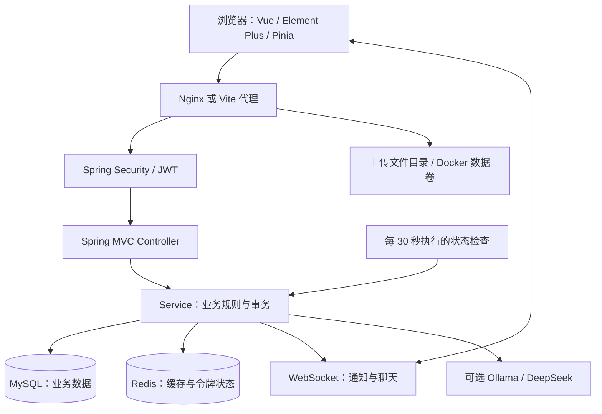

# 高校竞赛组队与训练平台：技术方案与功能模块

> 更新日期：2026-09-14。本文依据当前仓库源码、依赖锁文件、数据库脚本和验证结果重写，可作为毕业设计实现说明与答辩准备材料。功能描述以实际代码为准，待扩展能力在最后单独列出。

## 1. 项目定位与业务范围

平台面向高校学生，围绕“发现竞赛—寻找队友—组建团队—分阶段训练—展示成果”提供统一入口。管理员维护竞赛和训练资源、审核成果、处理反馈；学生自主设置技能和参赛意向，在愿意接受邀请的前提下参与队友推荐。

当前平台是前后端分离的 Web 应用，采用单体后端、关系数据库和 Redis，支持 Docker Compose 部署。它提供校内协作与训练管理能力，不代替竞赛主办方的正式报名系统，也不是内置在线评测或自动阅卷系统。

### 1.1 用户角色

| 角色 | 能力范围 |
|---|---|
| 游客 | 浏览公开竞赛、组队广场、成果墙、训练站点及统计；不能发起申请、聊天或修改资料 |
| 学生 | 维护资料、关注同学、创建或申请加入队伍、处理邀请、参与训练和讨论、提交成果及反馈 |
| 队长 | 队伍内的业务身份；管理申请、邀请成员、移除成员、维护队名简介、管理任务计划和资料、解散队伍 |
| 管理员 | 维护竞赛和训练站点、审核成果、处理反馈、查看操作日志 |

队长不是独立的全局账号角色，而是由 `team.captain_id` 和成员身份确定。接口仍须在服务端校验当前操作者，前端隐藏按钮只改善交互。

## 2. 技术栈与工程结构

### 2.1 版本基线

前端下表取自 `frontend/package-lock.json` 的锁定版本，而非 `package.json` 中范围声明的最低版本。

| 层次 | 技术及版本 | 用途 |
|---|---|---|
| 后端 | Java 17、Spring Boot 2.7.18 | REST 接口、依赖注入、事务及定时任务 |
| 持久化 | MyBatis-Plus 3.5.5、MySQL 8.0 系列 | 业务数据、分页、条件更新和行锁 |
| JDBC 驱动 | MySQL Connector/J 8.0.33 | 连接 MySQL；驱动版本不等于数据库服务器补丁版本 |
| 安全 | Spring Security、JJWT 0.11.5、BCrypt | 身份认证、角色授权、双令牌和密码散列 |
| 缓存 | Redis，Docker 使用 `redis:7-alpine` | 令牌黑名单、登录失败计数和热点查询缓存 |
| 实时通信 | Spring WebSocket | 大厅消息、私聊、团队讨论和业务通知 |
| 接口说明 | springdoc-openapi 1.7.0 | 自动生成 OpenAPI 与 Swagger UI |
| 前端 | Vue 3.5.41、Vue Router 4.6.4、Pinia 2.3.1 | 页面、路由及登录资料状态 |
| 界面 | Element Plus 2.14.4、Element Plus Icons | 表单、表格、弹窗及统一 SVG 图标 |
| 网络与图表 | Axios 1.19.0、ECharts 5.6.0 | 接口封装与数据可视化 |
| 前端构建 | Vite 5.4.21 | 开发服务器、资源打包和代理 |
| 测试 | JUnit 5、Mockito、H2 2.2.224、Node 测试、Playwright 验收 | 业务规则、持久化、代理及界面验证 |
| 部署 | Maven、Docker Compose、Nginx | JAR 打包、多服务编排和静态托管 |
| 可选模型 | Ollama / DeepSeek 接口 | 为规则排序结果生成推荐理由；不可用时保留规则说明 |

H2 只用于测试，不应将当前运行数据库描述为 H2。Docker 中 MySQL、Redis 等标签可能随镜像更新变化，确切运行版本应以实际容器为准。

### 2.2 架构



Controller 负责接收和校验参数，Service 负责权限与业务流程，Mapper 执行数据库操作，DTO/VO 分别承载请求和响应。WebSocket 提供及时通知，业务数据仍通过数据库持久化；定时任务独立于页面访问运行。

### 2.3 目录导航

```text
competition-platform/
├── backend/
│   ├── src/main/java/com/campus/competition/
│   │   ├── controller/、service/、mapper/
│   │   ├── entity/、dto/、vo/、support/
│   │   └── config/、security/、websocket/、seed/
│   ├── src/main/resources/schema.sql、application.yml
│   ├── src/test/java/                    后端自动化测试
│   ├── Dockerfile                       容器内源码构建
│   └── Dockerfile.runtime               从已打包 JAR 构建运行镜像
├── frontend/
│   ├── src/views/、components/、utils/
│   ├── src/api/、stores/、router/
│   ├── tests/                           Node 自动化测试
│   ├── package-lock.json、vite.config.js
│   └── Dockerfile、nginx.conf
├── docs/preparation-plan.md、docker-update.md
├── API-Contract.md
└── docker-compose.yml
```

## 3. 已实现的功能模块

### 3.1 账号、个人资料和社交关系

- 注册、登录、退出登录；JWT 访问令牌与刷新令牌；刷新失败后清理前端登录状态并引导重新登录。
- 个人中心展示昵称、用户名、学院、专业、简介、邮箱、技能标签、参赛意向、我的队伍和申请记录。
- 编辑资料会回填当前内容；邮箱支持修改、清空、首尾空格处理、格式和 100 字符上限校验。
- 资料采用局部更新，未提交字段保持原值；头像上传不会把学院、简介、邮箱等其他字段清空。
- 关注与粉丝双列表，展示人数、互相关注状态，支持昵称、用户名和院系搜索、每页 6 人的前端分页、回关、取消关注、主页和私聊入口。
- 公开范围与登录限制以 SecurityConfig 为准；当前个人主页接口要求登录，不应写成完全公开的个人资料门户。

参赛意向使用四种状态：`WANT_INVITE`（希望被邀请）、`ACCEPT_INVITE`（可接受邀请）、`NOT_PARTICIPATE`（暂不参赛）、`ONLY_VIEW`（仅浏览）。新注册账号默认仅浏览，前两种状态才进入推荐候选池。

### 3.2 头像裁剪与文件访问

上传头像先在浏览器内处理：选择原图 → 圆框裁剪 → 拖动或缩放 → 预览 → 压缩 → 上传 → 保存资料。支持鼠标、触摸拖动、方向键、滑块和滚轮；可以重置、重新选择或取消。

| 项目 | 当前规则 |
|---|---|
| 头像原图 | 最大 50MB；JPG、PNG、WebP、GIF、BMP；动态图取静态画面 |
| 裁剪处理 | 使用 Canvas，处理中间图最长边限制为 2048 像素 |
| 上传结果 | 512×512 JPG，质量 0.88，白色背景，前端保证不超过 1MB |
| 圆形效果 | 裁剪和头像展示为圆形，保存文件本身为方形 JPG |
| 保存时机 | 点击保存才上传；取消不上传；资料保存失败重试可复用已上传文件 |
| 服务端文件 | UUID 文件名，保存于上传目录，返回 `/uploads/...` 相对地址 |

Vite 的开发与预览模式、Docker Nginx 均配置 `/uploads` 代理。只验证上传接口成功不足以证明头像可用，还需要验证图片地址返回图片内容，以及保存后、刷新后的实际显示。

通用附件的 Spring Multipart 配置仍为 20MB；Docker Nginx 尚未显式放宽通用请求体限制，因此不能宣称 Docker 已支持所有 20MB 附件。头像经过压缩后上传，与原图的 50MB 选择上限是不同概念。

### 3.3 竞赛信息与自动状态检测

管理员创建、删除竞赛；学生按关键词、级别和报名状态筛选。竞赛字段包括名称、主办方、级别、报名开始 `signup_start`、报名截止 `signup_end`、开赛时间 `start_time` 和说明。

`CompetitionService.refreshStatuses()` 每 30 秒执行一次，用数据库条件更新重新计算状态：

| 判断顺序 | 条件 | 状态 |
|---|---|---|
| 1 | 已设置报名截止，且当前时间大于或等于截止时间 | 已结束 |
| 2 | 未满足上一条件，报名开始时间晚于当前时间 | 即将开始 |
| 3 | 其余情况，包括日期均未设置 | 报名中 |

到报名开始的准确时刻即进入报名中，到报名截止的准确时刻即结束报名。对于已有的矛盾日期，截止条件优先。任务启动后首次等待 30 秒，无需用户打开页面；首页和管理页也每 30 秒刷新列表。

每轮检测清理 `cache:competitions`，避免 Redis 把旧的报名状态继续返回。单实例内对列表缓存读写、竞赛写操作和扫描使用同一锁，避免旧查询在清缓存后重新写回旧状态。该锁不是跨实例分布式锁。

**语义边界：当前“已结束”表示竞赛报名已结束。数据模型没有独立的赛事结束时间，也没有“比赛进行中”状态；`start_time` 不应被误当作赛事结束时间。**

### 3.4 组队、邀请及队伍生命周期

组队广场支持筛选、分页、创建和申请；队长可以审批申请、发出邀请。被邀请者可以接受或拒绝邀请，接受后直接入队。

邀请关联具体 `team_application.id`。通知已读与邀请是否处理是两个独立维度，点开通知不会自动接受或拒绝邀请；同一用户的不同邀请不会互相覆盖。

队伍支持改名、修改简介、移除成员、成员退出与解散。队长不能通过普通退出流程离队。移除、退出和解散写入退出记录，并在相关流程发送通知。

`TeamDeadlineScheduler` 每 30 秒将 `deadline <= 当前时间` 且尚未结束的队伍更新为“已结束”，覆盖招募中、已满员和备赛中；未设置截止时间的队伍不受影响。到期保留成员、资料和任务，不自动解散队伍。

申请、邀请、批准和接受邀请会在操作时即时检查截止时间，避免等待扫描期间仍能加入。到期满员队伍即使出现空位也不会重新招募。前端每 30 秒刷新队伍状态，结束后关闭申请入口和批准、邀请按钮。

**竞赛报名截止与队伍组队截止是两套规则。当前不会仅因竞赛报名结束而批量结束其全部队伍，也未把报名状态作为创建队伍的统一服务端门槛。**

### 3.5 推荐队友：规则评分与可选模型解释

推荐首先筛选学生账号，排除队长、已有成员、待审批申请人和不愿接受邀请的用户。规则计算匹配分，降序取前 10 人；模型只为前 3 人补充个性化推荐理由，不决定排序，也不自动邀请成员。

| 评分维度 | 当前代码的计算方式 |
|---|---|
| 技能契合 | 交集技能数 / 队伍需求技能数 × 40，四舍五入；无需求技能时为 0 |
| 方向契合 | 根据竞赛名称映射相关技能关键词，命中为 25，未命中为 12 |
| 参赛意向 | 希望被邀请为 20，可接受邀请为 12 |
| 经验 | 存在个人成果记录为 10，否则为 5 |

方向维度在设计上标称 30 分，但当前实现是 25/12 两档，不是连续的 0～30 分。经验判断只检查成果记录是否存在，没有限定为已审核通过。文档和答辩不应把这些规则描述成训练得到的预测模型或严格的获奖认证。

模型支持 Ollama 和 DeepSeek 配置。调用超时、无内容或解析失败时保留规则理由，通过 `reasonSource` 区分来源。是否真的调用模型取决于部署配置和模型服务可用性。

### 3.6 团队备赛计划、任务与复盘

- 队长可生成准备阶段、专项训练、模拟冲刺、作品提交四阶段计划；生成会参考目标时间或竞赛开赛时间，已有任务时不会覆盖。
- 任务支持标题、说明、阶段、优先级、负责人、截止时间和同队资料关联。
- 看板状态为待完成、进行中、已完成；支持阶段进度、逾期筛选和“只看我的”。
- 当前负责人或队长可更新任务状态；完成可记录复盘及完成时间，重新打开时清除完成信息。
- 创建、编辑、删除和计划生成校验队长身份；任务查询及操作校验当前成员身份，离队用户无法继续操作原队任务。
- 使用事务和行锁处理计划生成、任务更新和邀请接受等关键并发流程，避免部分写入或重复加入。

阶段计划由业务模板生成，不是大模型生成课程；平台没有内置代码评测、训练题自动评分或论文自动评价。

### 3.7 资料、团队讨论与消息通知

团队成员可访问同队资料和讨论；上传、删除资料及讨论删除按相应成员、上传者、作者或队长权限处理。任务只能关联本队资料。

聊天包括组队大厅与私聊，另有队伍内讨论。WebSocket 提供实时消息，部分前端场景有轮询补偿。大厅聊天接口要求登录，访客只加载公开队伍信息。

私聊门控：主动发起前需关注对方；对方未回关、未回复时最多发一条；对方已发过消息时可直接回复。内容过滤是本地规则过滤，不等于完整的智能审核系统。

通知涵盖申请、审批、邀请及处理、任务分配、成员变化等。通知落库后在相关事务提交后推送，回滚不会提前向用户发送成功消息。

### 3.8 训练中心

支持按竞赛或标签查找训练站点、收藏、每日打卡、累计和连续天数、本月日历、等级与排行榜；管理员管理训练站点。资源主要通过链接引导到外部站点，平台记录自己的训练参与情况。

累计打卡等级为：见习（不足 7 天）、进阶（7 天）、熟练（30 天）、大师（100 天）、宗师（300 天）。打卡表具有用户与日期的唯一约束，收藏表具有用户与站点的唯一约束。

### 3.9 成果、反馈、统计与管理

- 学生提交成果及证明，管理员审核，公开成果墙展示审核结果允许公开的内容。
- 用户提交反馈、查看自己的处理记录；管理员回复和处理反馈。
- 数据看板展示用户、队伍、竞赛、成果及热门竞赛等汇总，前端采用 ECharts。
- 管理端提供竞赛、成果审核、反馈、训练站点和操作日志入口。
- 操作日志记录代码明确调用日志服务的行为，不能宣称已对所有接口实现完整审计。

## 4. 数据模型

`schema.sql` 当前声明 **21 张表**。下表为逻辑关系，不能等同于全部关系都已设置数据库外键。

| 表 | 用途及主要关联 |
|---|---|
| users | 账号、资料、角色、参赛意向 |
| skill_tag | 技能标签字典 |
| user_skill | 用户与技能多对多关系 |
| competition | 竞赛及报名时间、开赛时间、状态 |
| team | 队伍、目标竞赛、队长、人数、组队截止时间 |
| team_member | 用户与队伍的成员关系 |
| team_application | 入队申请与邀请，`invited` 区分类型 |
| ai_recommendation | 推荐记录预留表；当前推荐主流程实时计算，不应据此声称已有完整推荐历史功能 |
| team_task | 阶段、优先级、负责人、资料、进度及复盘 |
| resource | 团队共享资料元数据 |
| achievement | 个人／队伍成果及审核状态 |
| user_follow | 关注者与被关注者关系 |
| notification | 通知、已读状态及邀请关联 |
| operation_log | 操作日志 |
| team_exit_log | 退出、移除、解散记录 |
| feedback | 用户反馈与处理信息 |
| chat_message | 大厅和私聊消息 |
| team_discussion | 团队讨论消息 |
| training_site | 训练站点与分类信息 |
| training_checkin | 用户每日打卡记录 |
| training_favorite | 用户收藏的训练站点 |

`PreparationSchemaUpgrade` 对已有任务和通知表补齐当前功能所需字段。它是特定版本的兼容升级器，不是完整的 Flyway/Liquibase 迁移体系。首次空库可由播种程序生成演示数据，已有核心用户数据时不会重新初始化核心数据。

## 5. 接口与一致性设计

统一响应为 `{code, message, data}`。业务成功代码为 200；前端同时处理 HTTP 状态和响应体业务码。错误不一定对应 HTTP 4xx，例如部分参数错误以业务码返回，应以实际接口封装为准。

| 接口组 | 主要路径 |
|---|---|
| 认证、资料 | `/api/auth/*`、`/api/user/profile`、`/api/user/skills` |
| 用户关系 | `/api/users/{id}`、`/api/users/me/following`、`/api/users/me/followers` |
| 竞赛、队伍 | `/api/competitions`、`/api/teams`、`/api/teams/{id}` |
| 邀请处理 | `/api/teams/invites/{appId}/accept`、`/reject` |
| 推荐 | `/api/ai/recommend?teamId=...` |
| 任务与计划 | `/api/teams/{id}/tasks`、`/api/tasks/{taskId}`、`/api/teams/{id}/tasks/plan` |
| 资料与讨论 | `/api/teams/{id}/resources`、`/api/teams/{id}/discussions` |
| 聊天、通知 | `/api/chat/*`、`/api/notifications` |
| 训练 | `/api/training/sites`、`/checkin`、`/favorites` 等 |
| 成果、反馈、统计 | `/api/achievements`、`/api/feedback`、`/api/stats/overview` |
| 文件 | `/api/files/upload`；实际文件通过 `/uploads/...` 访问 |

详细参数参考 [接口契约](competition-platform/API-Contract.md)、[备赛计划说明](competition-platform/docs/preparation-plan.md) 和运行时 `/swagger-ui.html`。

关键一致性措施包括：个人资料局部更新；邀请记录精确关联通知；关键修改使用事务与行锁；条件 SQL 仅更新需要变化的状态；截止时间操作校验与定时扫描共同工作；前端重复提交保护；并发 401 共用一次刷新请求。上述措施覆盖特定流程，不代表所有模块都已完成分布式并发验证。

## 6. 安全与运行配置

密码使用 BCrypt，认证使用 JWT Bearer。默认访问令牌有效期 2 小时、刷新令牌 7 天，后端可配置。Redis 保存黑名单与登录失败计数；退出会失效当前访问令牌，刷新会轮换刷新令牌。前端以 Pinia 和本地存储维护登录状态。

后端通过 Spring Security 和服务层检查控制管理员、队长、成员以及资料归属。上传接口有扩展名白名单；头像前端还会实际解码并重新编码图片。未实现邮箱验证码认证、全量恶意文件扫描或对象存储私有签名下载。

部署时通过环境变量注入数据库连接、Redis、JWT 密钥和模型配置。技术文档、截图和仓库不应包含真实账号密码或 API Key。当前开发配置中的默认值仅用于本机演示，正式环境需替换。

时间在接口中使用 `yyyy-MM-dd HH:mm:ss`；Docker 采用 `Asia/Shanghai`。定时扫描不是逐毫秒触发的截止事件，在正常运行下数据库更新存在一个扫描周期的延迟，页面轮询还会增加显示延迟。

## 7. 部署与更新

### 7.1 本地开发

准备 Java 17、Maven、Node/npm、MySQL 和 Redis。在项目目录中配置连接后启动后端，前端执行 `npm ci` 和 `npm run dev`。Vite 默认使用 5173，后端使用 8080；Vite 将 `/api`、`/uploads` 和 `/ws` 转发到后端。

### 7.2 Docker

在 `competition-platform` 目录执行：

```powershell
docker compose build backend frontend
docker compose up -d --no-build
docker compose ps
```

浏览器访问 `http://localhost`。四个服务为 `cp-frontend`、`cp-backend`、`cp-mysql` 和 `cp-redis`；上传、MySQL 和 Redis 使用独立数据卷。

容器内 Maven 下载依赖较慢时，可使用经过本机测试的 JAR：

```powershell
mvn -f backend/pom.xml test package
docker build -f backend/Dockerfile.runtime -t competition-platform-backend backend/target
docker compose build frontend
docker compose up -d --no-build
```

前端 Dockerfile 使用 `npm ci` 锁定依赖。源码修改后必须重新构建并替换容器，仅重启旧容器不会更新程序。保留原数据卷，更新前备份数据库和上传文件；不要用 `docker compose down -v` 进行普通更新。更多步骤见 [Docker 更新说明](competition-platform/docs/docker-update.md)。

## 8. 测试与验收

后端当前自动化测试为 **40 项**：队伍服务单元测试、H2/MyBatis 持久化集成测试、资料及关注接口测试。覆盖邀请并发接受、阶段计划生成、成员权限、任务复盘、事务后通知、邮箱局部更新、组队截止，以及本次新增的竞赛开始／截止边界、空日期、重复扫描和缓存失效。

前端 Node 测试覆盖头像尺寸限制、裁剪边界和开发／预览图片代理。浏览器验收检查头像裁剪、真实图片访问、邮箱修改、关注列表、队伍状态刷新以及窄屏布局。浏览器辅助脚本目前位于本机忽略目录，未全部纳入仓库测试流程。

```powershell
# 在 competition-platform 目录
mvn -f backend/pom.xml test

# 在 frontend 目录
node --test tests/avatar.test.js tests/uploads-proxy.test.js
npm run build
```

代理测试的预览分支使用构建产物，首次运行前需先执行 `npm run build`。Docker 验收还应检查 API 返回、静态资源、容器日志、数据库记录和数据卷，不能仅用构建成功代替运行验证。

H2 集成测试不能替代全部 MySQL 特性验证；当前未给出大规模压力测试、可用性 SLA 或推荐效果实验的统计结论，不应在论文中虚构这些指标。

### 8.1 建议答辩演示流程

1. 展示竞赛筛选及报名状态；使用专门的测试竞赛演示开始与截止后的自动转换。
2. 学生完善技能、邮箱和头像，设置愿意接受邀请，查看关注与粉丝。
3. 队长创建测试队伍，查看规则推荐及模型理由来源，邀请另一账号并处理通知。
4. 生成四阶段计划，分配负责人、关联资料，完成任务并填写复盘。
5. 在测试队伍到期后展示“已结束”，并验证无法继续申请或接受邀请。
6. 展示训练打卡、成果审核、反馈管理，以及 Docker 中的部署状态。

演示应使用测试账号和测试记录；模型服务未运行时如实展示规则回退。

## 9. 当前限制与后续扩展

| 方向 | 当前边界 | 可继续完善 |
|---|---|---|
| 竞赛生命周期 | 只有报名状态，没有赛事结束时间 | 增加比赛进行中、赛事结束等独立字段和状态 |
| 跨模块时间规则 | 竞赛报名截止与队伍截止独立 | 明确是否允许为报名已结束赛事继续创建或招募队伍 |
| 推荐质量 | 手工规则评分，模型补充理由 | 已审核成果过滤、效果评估、行为反馈与推荐历史 |
| 分布式部署 | 单实例扫描和 JVM 缓存锁 | 多实例任务协调、版本化缓存和更完整监控 |
| 附件与隐私 | 本地文件、公共静态路径 | Nginx 上传限制统一、私有下载鉴权、文件检测、对象存储 |
| 数据规模 | 部分列表前端分页或逐项查询 | 服务端分页、批量查询、索引及性能测试 |
| 数据库演进 | 初始化脚本与特定字段升级器 | 版本化迁移、恢复演练与备份自动化 |
| 测试交付 | 核心自动化测试及本机浏览器验收 | 将浏览器回归纳入仓库和 CI，补充真实 MySQL 并发测试 |

毕业设计的主要实现价值在于完整的组队与邀请流程、明确的成员权限、可解释推荐、阶段训练与复盘、截止状态维护，以及可部署和可验证的前后端协作链路。
